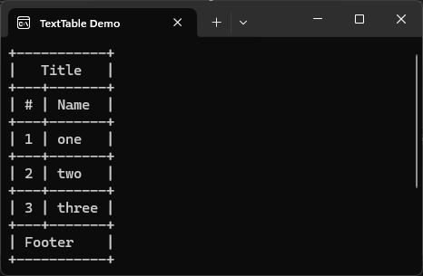
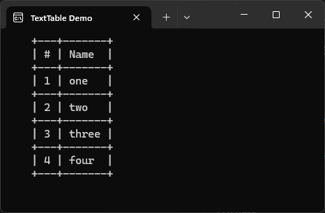
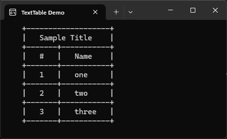

Work with text tables with ease.

[GitHub repository](https://github.com/trustsoft/Trustsoft.TextTables "Visit GiHub Repository")\


[](https://dotnet.microsoft.com/en-us/languages/csharp)
[](https://learn.microsoft.com/en-us/dotnet/fundamentals/)

[](https://www.nuget.org/packages/Trustsoft.TextTables/latest)
[](https://www.nuget.org/packages/Trustsoft.TextTables/absoluteLatest )


#### Features:
- Table indentation;
- Table title;
- Table footer;
- Table ruler;
- Column content indentation;
- Column content alignment (left, right).

### Usage:
```csharp
// --- Sample #1 ---
// Default table configuration options + Title and Footer.
var t = new TextTable(["#", "Name"]);
t.Title = "Title";
t.AddRow(1, "one");
t.AddRow(2, "two");
t.AddRow(3, "three");
t.AddFooter("Footer");
t.Write();
```

```csharp
// --- Sample #2 ---
// Default table configuration options + table indent = 4.
var t = new TextTable(["#", "Name"]);
t.Options.Indent = 4;
t.AddRow(1, "one");
t.AddRow(2, "two");
t.AddRow(3, "three");
t.Write();
```

```csharp
// --- Sample #3 ---
// Default table configuration options +  Title = "Sample Title", table indent = 4, ContentIndent = 3.
var t = new TextTable(["#", "Name"]);
t.Title = "Sample Title";
t.Options.Indent = 4;
t.Options.ContentIndent = 3;
t.AddRow(1, "one");
t.AddRow(2, "two");
t.AddRow(3, "three");
t.Write();
```
